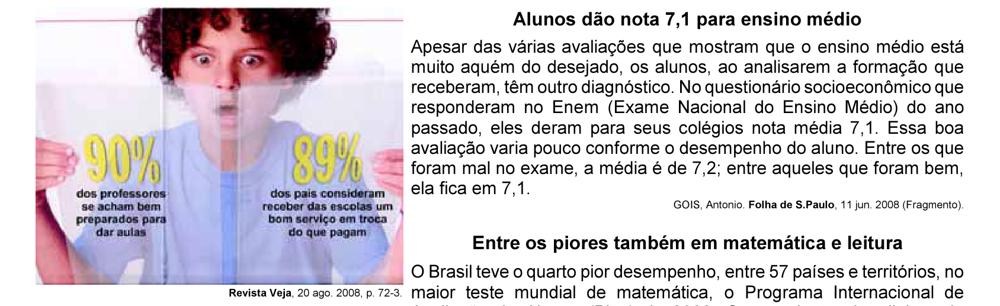
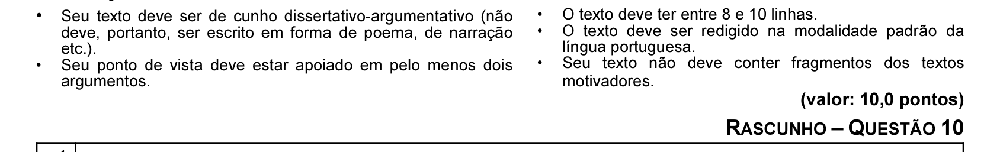

# Questão 10

2005 para 2007, o país melhorasse os indicadores de qualidade da educação. O avanço foi mais visível no ensino fundamental. No ensino médio, praticamente não houve melhoria. Numa escala de zero a dez, o ensino fundamental em seus anos iniciais (da primeira à quarta série) teve nota 4,2 em 2007. Em 2005, a nota fora 3,8. Nos anos finais (quinta a oitava), a alta foi de 3,5 para 3,8. No ensino médio, de 3,4 para 3,5. Embora tenha comemorado o aumento da nota, ela ainda foi considerada “pior do que regular” pelo ministro da Educação, Fernando Haddad.

A partir da leitura dos fragmentos motivadores reproduzidos, redija um texto dissertativo (fundamentado em pelo menos dois argumentos), sobre o seguinte tema: A contradição entre os resultados de avaliações oficiais e a opinião emitida pelos professores, pais e alunos sobre a educação brasileira. No desenvolvimento do tema proposto, utilize os conhecimentos adquiridos ao longo de sua formação. Observações

GOIS, Antonio. Folha de S.Paulo, 11 jun. 2008 (Fragmento).

WEBER, Demétrio. Jornal O Globo, 5 dez. 2007, p. 14 (Fragmento).

GOIS, Antonio; PINHO, Angela. Folha de S.Paulo, 12 jun. 2008 (Fragmento).
