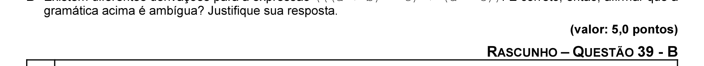

# Questão 39

Qualquer expressão aritmética binária pode ser convertida em uma expressão totalmente parentizada, bastando reescrever cada subexpressão binária a q b como (a q b), em que q denota um operador binário. Expressões nesse formato podem ser definidas por regras de uma gramática livre de contexto, conforme apresentado a seguir. Nessa gramática, os símbolos não-terminais E, S, O e L representam expressões, subexpressões, operadores e literais, respectivamente, e os demais símbolos das regras são terminais. E 6 ( S O S ) S 6 L | E O 6 + | - | * | / L 6 a | b | c | d | e Tendo como referência as informações acima, faça o que se pede a seguir. A Mostre que a expressão (a * (b / c)) pode ser obtida por derivações das regras acima. Para isso, desenhe a árvore de análise sintática correspondente. (valor: 5,0 pontos)

B Existem diferentes derivações para a expressão (((a + b) * c) + (d * e)). É correto, então, afirmar que a

