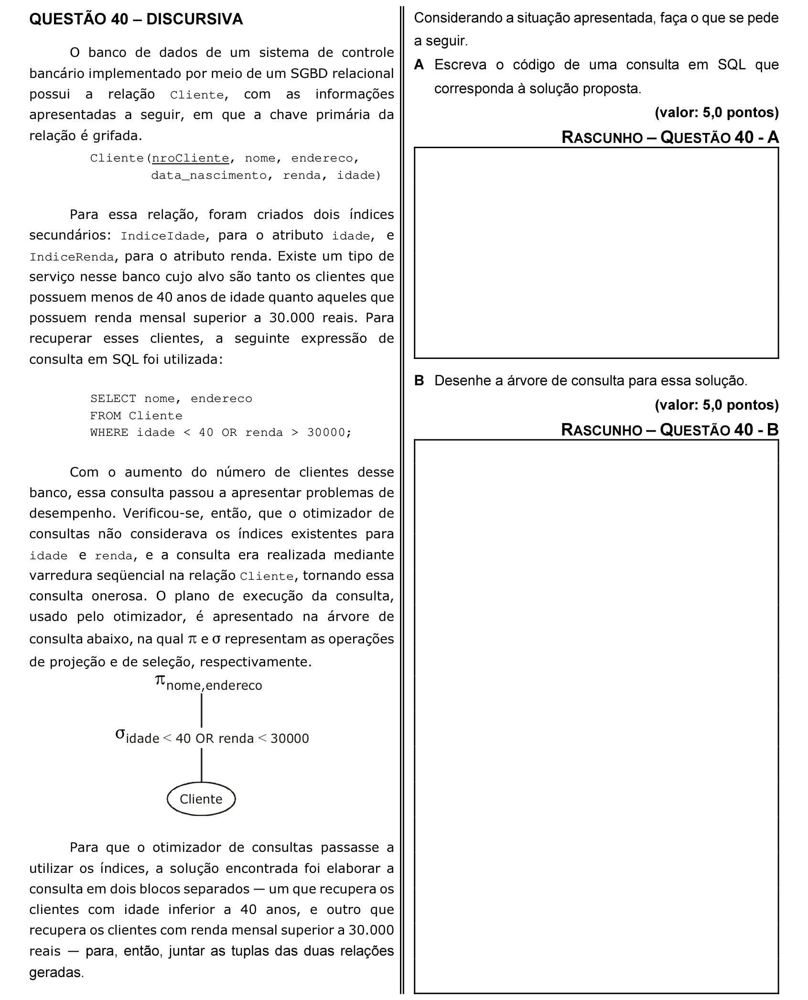

# Questão 40

B	nome,endereco A Escreva o código de uma consulta em SQL que

B Desenhe a árvore de consulta para essa solução.

As questões de 41 a 60, a seguir, são específicas para os estudantes de cursos com perfis profissionais de ENGENHARIA DE COMPUTAÇÃO.
