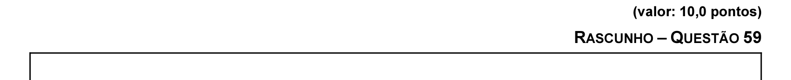

# Questão 59

No projeto de sistemas de tempo real, normalmente são atribuídas prioridades às tarefas. Escalonadores orientados à preempção por prioridade são utilizados para ordenar a execução de tarefas de modo a atender seus requisitos temporais. Inversão de prioridade é o termo utilizado para descrever a situação na qual a execução de uma tarefa de mais alta prioridade é suspensa em benefício de uma tarefa de menor prioridade. A inversão de prioridade pode ocorrer quando tarefas com diferentes prioridades necessitam utilizar um mesmo recurso simultaneamente. A duração desta inversão pode ser longa o suficiente para causar a perda do deadline das tarefas suspensas. Protocolos de sincronização em tempo real auxiliam limitando e minimizando a inversão de prioridades. Considere o conjunto de três tarefas com as seguintes características: I T1 tem prioridade 1 (mais alta), custo de execução total de 6 ut (unidades de tempo) e instante de chegada t1 = 6. A partir de seu início, após executar durante 1 ut, essa tarefa necessita do recurso compartilhado R1 durante 2 ut. Para concluir, utiliza o recurso compartilhado R2 durante 2 ut finais. T2 tem prioridade 2, custo de execução total de 8 ut e instante de chegada t2 = 3. A partir de II seu início, após executar durante 2 ut, a tarefa necessita do recurso compartilhado R2 durante 2 ut. III T3 tem prioridade 3 (mais baixa), custo total de execução de 12 ut e instante de chegada t3 = 0. A partir de seu início, após executar durante 2 ut, essa tarefa necessita do recurso compartilhado R1 durante 2 ut. A partir dessas informações, desenhe a(s) linha(s) de tempo(s) para que um escalonamento dessas três tarefas em um único processador seja possível, utilizando-se o protocolo de herança de prioridade.

