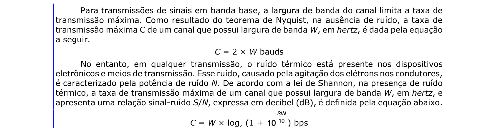
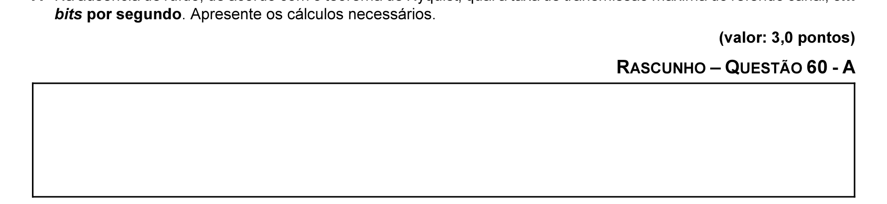
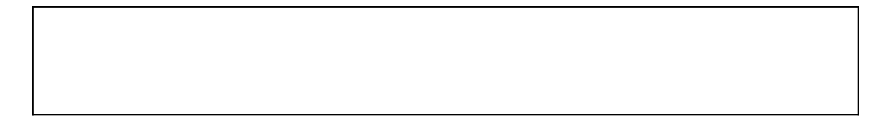

# Questão 60

C = 2 × W bauds

C = W × log2 (1 +

Tendo como referência inicial as informações acima, considere que seja necessário determinar a taxa de transmissão máxima de um canal de comunicação que possui largura de banda de 3 kHz, relação sinal-ruído de 30,1 dB e adota 16 diferentes níveis de sinalização. Nessa situação, responda aos seguintes questionamentos.

A Na ausência de ruído, de acordo com o teorema de Nyquist, qual a taxa de transmissão máxima do referido canal, em

B Na presença de ruído térmico, de acordo com a lei de Shannon, qual a taxa de transmissão máxima do canal, em bits por segundo? Apresente os cálculos necessário e considere que log10 (1.023) = 3,01.

C Na presença de ruído térmico, é possível adotar mais de 16 níveis de sinalização no referido canal? Justifique. (valor: 3,0 pontos)

(valor: 4,0 pontos)

Figura para a questão 61 Estágios do ciclo de vida de um serviço de TI Gerenciamento de aplicações Gerente do desenvolvimento de aplicações Negócios Entrega de serviços Gerente de serviços Cliente Usuário

Estratégias, planos e requisitos Soluções de negócios

Definir Planejar Implantar Validar Estabelecer políticas serviços serviços serviços estratégias Desenho e planejamento Implantação Suporte técnico Administração
