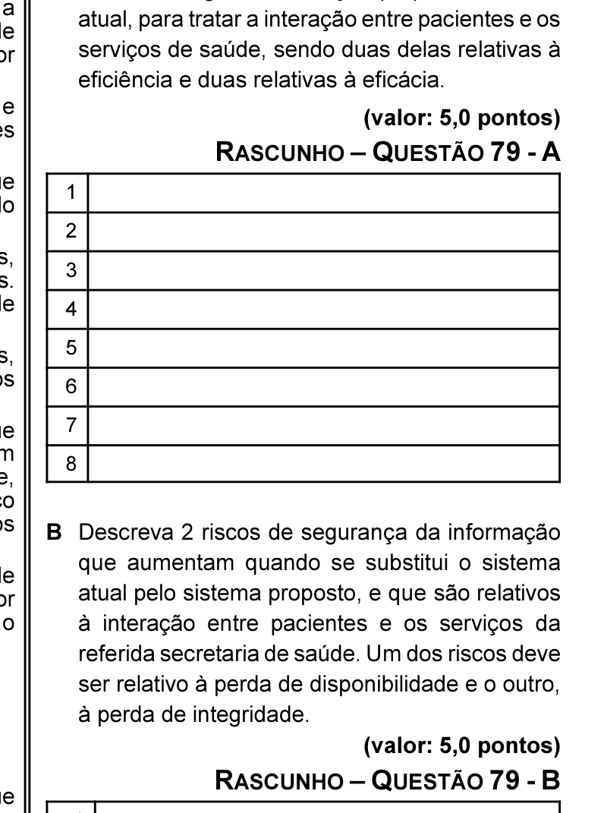

# Questão 79

Considerando as informações apresentadas no texto e considerando ainda que entre os principais benefícios de um projeto de melhoria de sistema de informação destacam-se o aumento da: (I) eficiência; (II) eficácia; (III) integridade; e (IV) disponibilidade, faça o que se pede a seguir. A Cite 4 vantagens da solução proposta, frente à

B Descreva 2 riscos de segurança da informação
