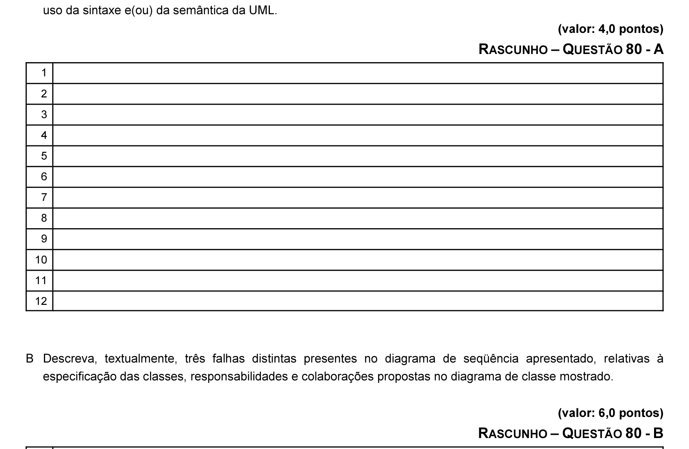

# Questão 80

Durante a análise de um sistema de controle de contas bancárias (SCCB), um analista elaborou o diagrama de classes acima, em que são especificados os objetos de negócio da aplicação, por meio do qual foram distribuídas as responsabilidades e colaborações entre os elementos do modelo. Foi atribuída a outro analista a tarefa de elaborar o diagrama de seqüência do caso de uso chamado DUPLA_CONTA, que apresenta o seguinte comportamento: cria um banco, cria uma agência bancária, cria um cliente e duas contas bancárias associadas ao cliente e agência bancária anteriormente criados, e, por fim, realiza uma transferência de valores entre essas duas contas bancárias. O diagrama de seqüência em UML apresentado abaixo foi elaborado com o intuito de corresponder ao caso de uso em questão.

No diagrama de seqüência apresentado, há problemas conceituais, relativos à especificação do diagrama de classes e à descrição textual do caso de uso DUPLA-CONTA. Com relação a essa situação, faça o que se pede a seguir.

A Descreva, textualmente, três falhas de tipos distintos presentes no diagrama de seqüência apresentado, relativas ao

B Descreva, textualmente, três falhas distintas presentes no diagrama de seqüência apresentado, relativas à
