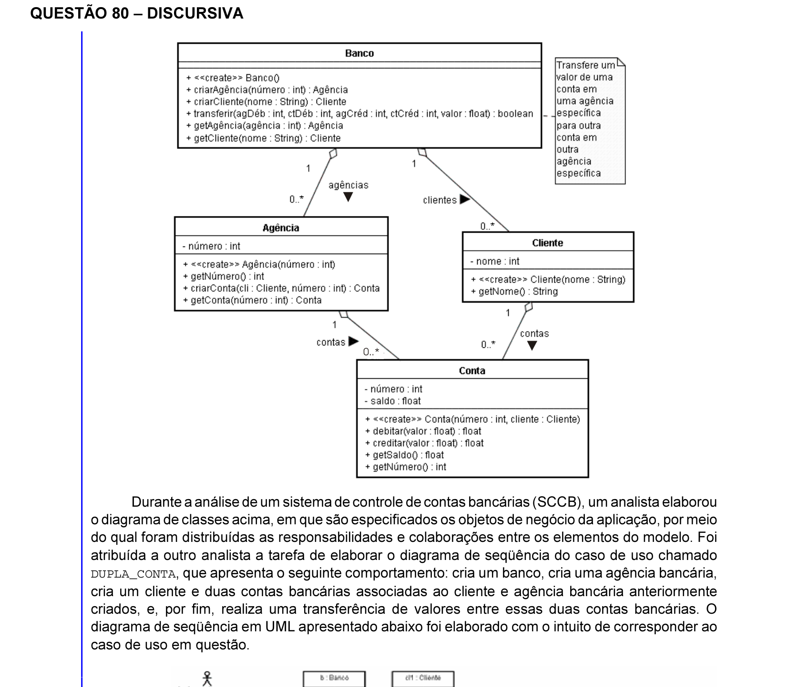
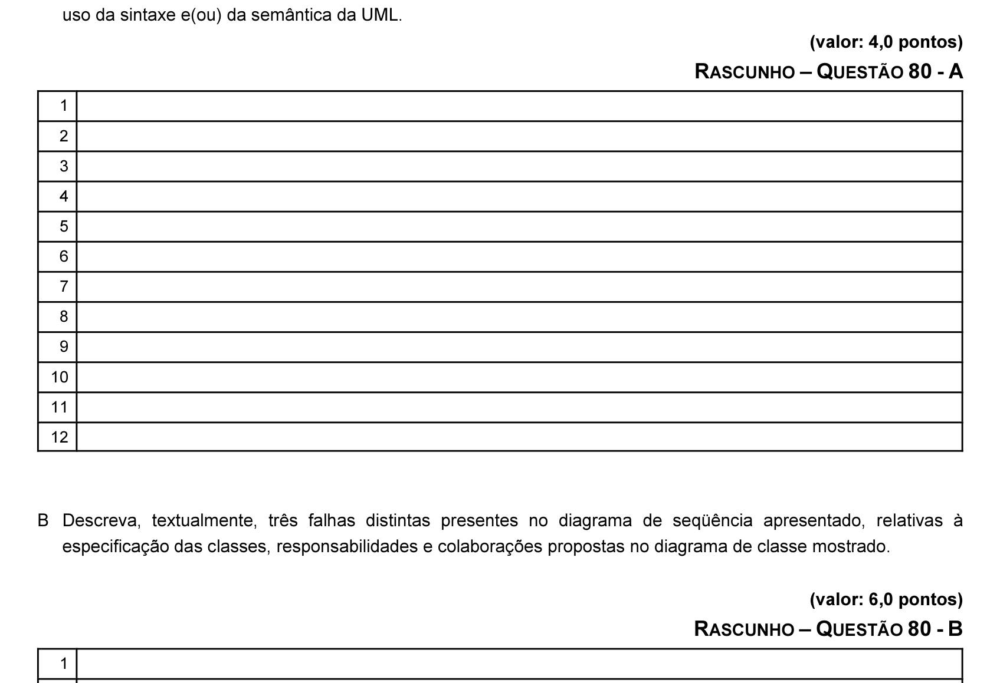

# Questão 80

No diagrama de seqüência apresentado, há problemas conceituais, relativos à especificação do diagrama de classes e à descrição textual do caso de uso DUPLA-CONTA. Com relação a essa situação, faça o que se pede a seguir.

A Descreva, textualmente, três falhas de tipos distintos presentes no diagrama de seqüência apresentado, relativas ao

B Descreva, textualmente, três falhas distintas presentes no diagrama de seqüência apresentado, relativas à
