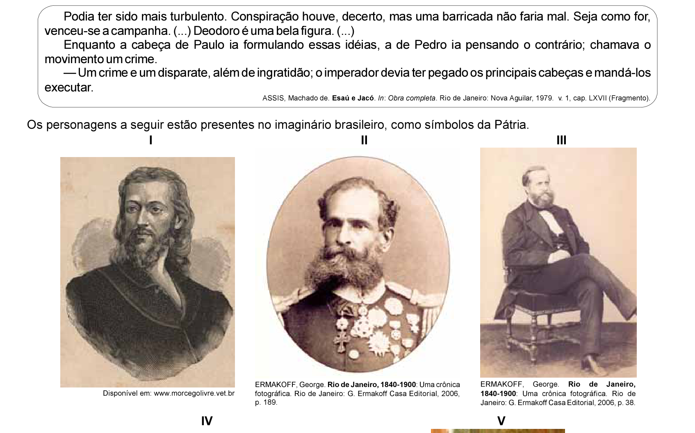
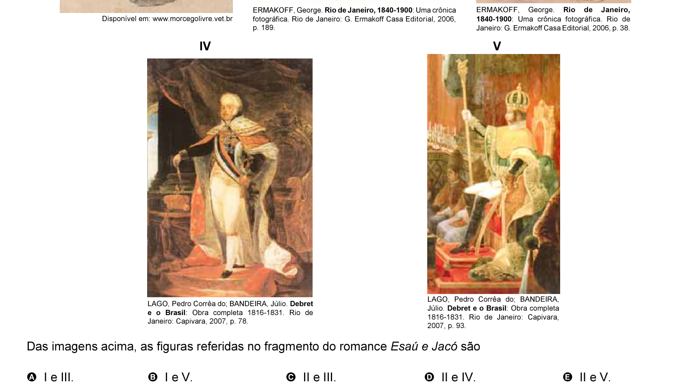

# Questão 1

O escritor Machado de Assis (1839-1908), cujo centenário de morte está sendo celebrado no presente ano, retratou na sua obra de ficção as grandes transformações políticas que aconteceram no Brasil nas últimas décadas do século XIX. O fragmento do romance Esaú e Jacó, a seguir transcrito, reflete o clima político-social vivido naquela época.

Das imagens acima, as figuras referidas no fragmento do romance Esaú e Jacó são

## Alternativas

A. I e III.
B. I e V.
C. II e III.
D. II e IV.
E. II e V.
