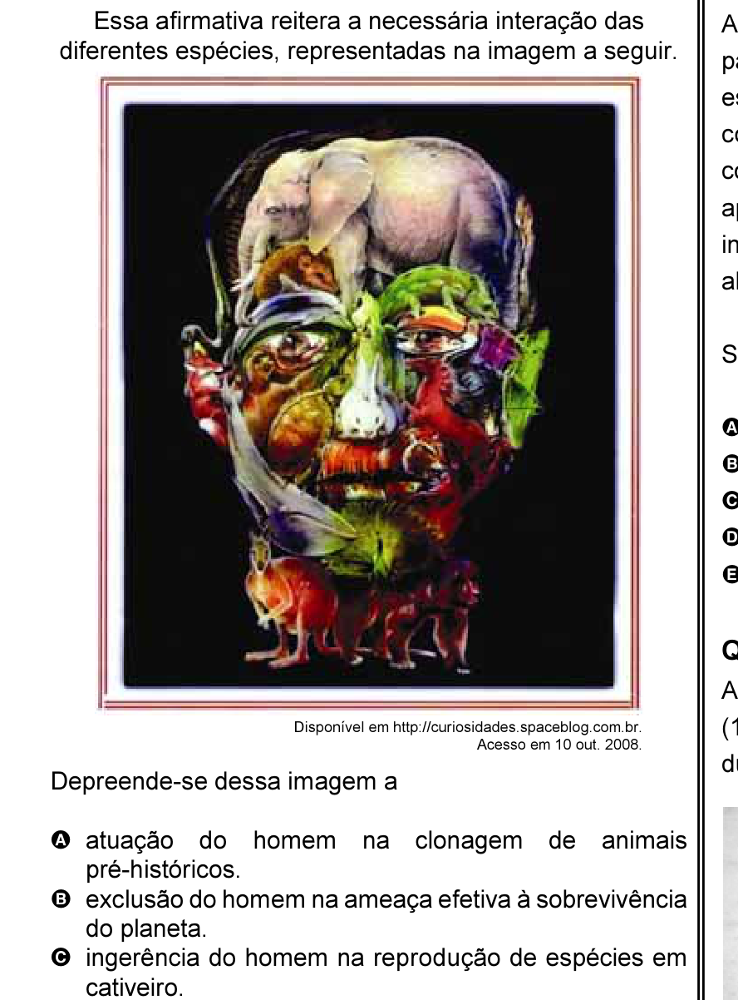

# Questão 2

Quando o homem não trata bem a natureza, a natureza não trata bem o homem.

## Alternativas

A. atuação do homem na clonagem de animais pré-históricos.
B. exclusão do homem na ameaça efetiva à sobrevivência do planeta.
C. ingerência do homem na reprodução de espécies em cativeiro.
D. mutação das espécies pela ação predatória do homem.
E. responsabilidade do homem na manutenção da biodiversidade.
