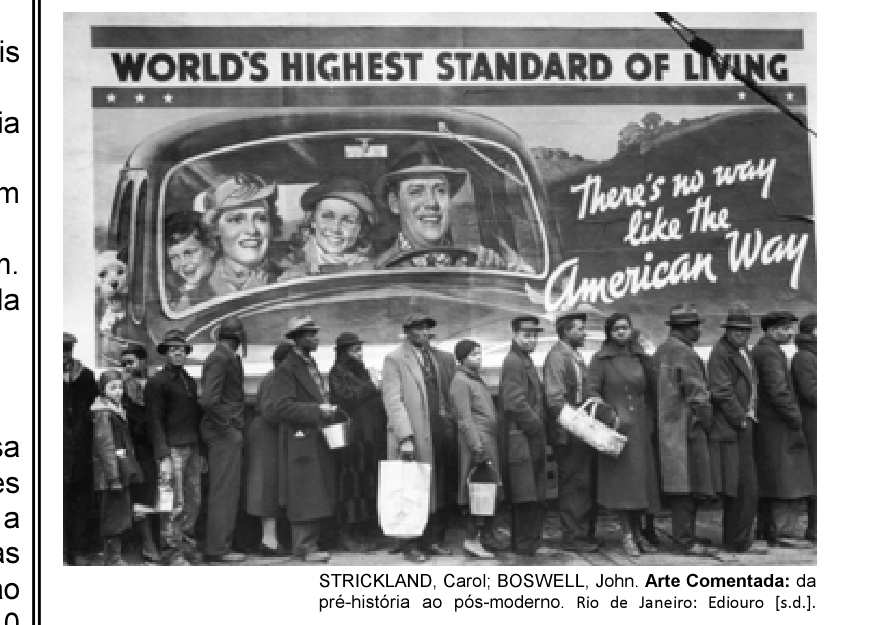

# Questão 5

A foto a seguir, da americana Margaret Bourke-White (1904-71), apresenta desempregados na fila de alimentos durante a Grande Depressão, que se iniciou em 1929.

Além da preocupação com a perfeita composição, a artista, nessa foto, revela

## Alternativas

A. a capacidade de organização do operariado.
B. a esperança de um futuro melhor para negros.
C. a possibilidade de ascensão social universal.
D. as contradições da sociedade capitalista.
E. o consumismo de determinadas classes sociais.
