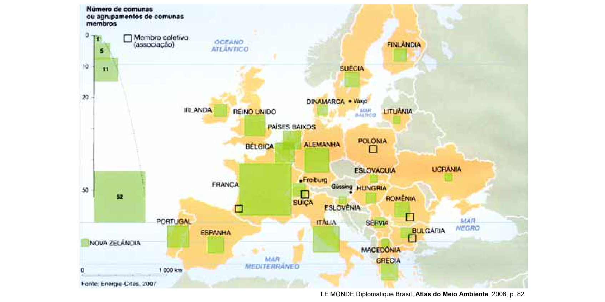

# Questão 6

CENTROS URBANOS MEMBROS DO GRUPO “ENERGIA-CIDADES”

No mapa, registra-se uma prática exemplar para que as cidades se tornem sustentáveis de fato, favorecendo as trocas horizontais, ou seja, associando e conectando territórios entre si, evitando desperdícios no uso de energia. Essa prática exemplar apóia-se, fundamentalmente, na

## Alternativas

A. centralização de decisões políticas.
B. atuação estratégica em rede.
C. fragmentação de iniciativas institucionais.
D. hierarquização de autonomias locais.
E. unificação regional de impostos.
