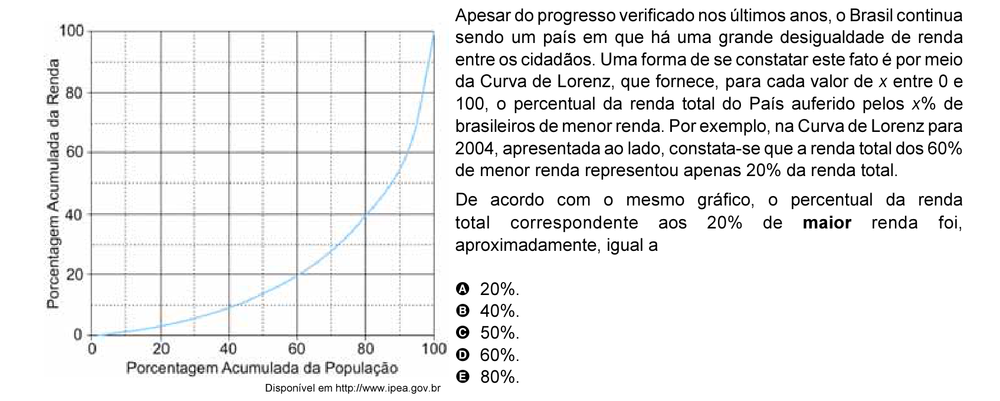

# Questão 7

De acordo com o mesmo gráfico, o percentual da renda total correspondente aos 20% de maior renda foi,

Disponível em http://www.ipea.gov.br

## Alternativas

A. 20%.
B. 40%.
C. 50%.
D. 60%.
E. 80%.
