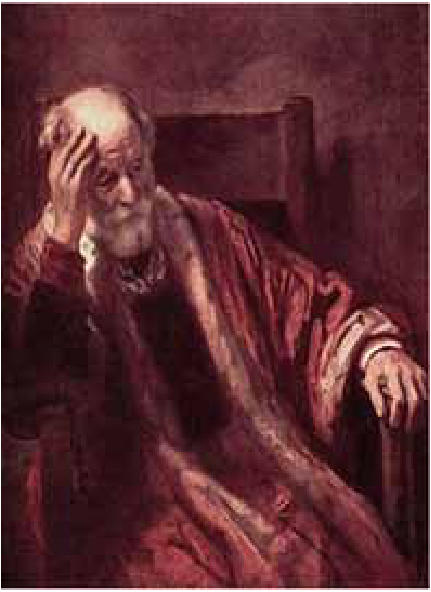
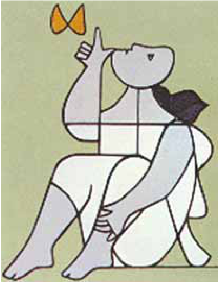
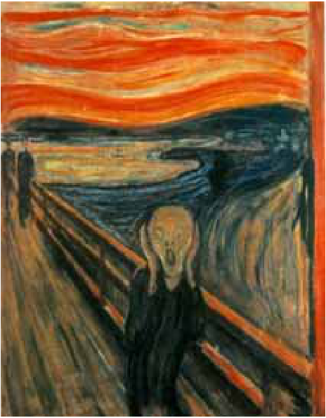
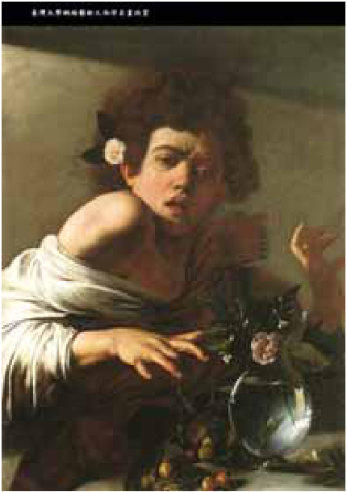
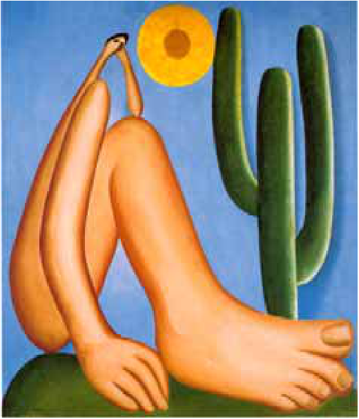

# Questão 8

O filósofo alemão Friedrich Nietzsche (1844-1900), talvez o pensador moderno mais incômodo e provocativo, influenciou várias gerações e movimentos artísticos. O Expressionismo, que teve forte influência desse filósofo, contribuiu para o pensamento contrário ao racionalismo moderno e ao trabalho mecânico, através do embate entre a razão e a fantasia. As obras desse movimento deixam de priorizar o padrão de beleza tradicional para enfocar a instabilidade da vida, marcada por angústia, dor, inadequação do artista diante da realidade. Das obras a seguir, a que reflete esse enfoque artístico é

## Alternativas

A.  Homem idoso na poltrona Rembrandt van Rijn – Louvre, Paris.
B.  Figura e borboleta Milton Dacosta
C.  O grito – Edvard Munch – Museu Munch, Oslo Disponível em: http://members.cox.net
D.  Menino mordido por um lagarto Michelangelo Merisi (Caravaggio)
E.  Abaporu – Tarsila do Amaral Disponível em: http://tarsiladoamaral.com.br
