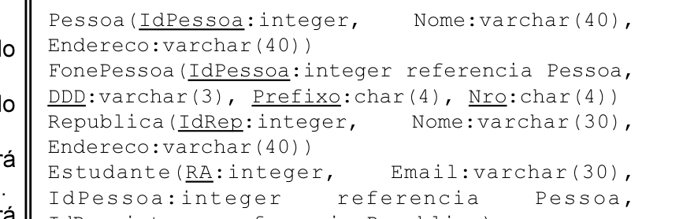

# Questão 23

## Alternativas

A. Estudante(10, ‘jsilva@ig.com.br’, null, 20); FonePessoa(10, ‘019’, ‘3761’, ‘1370’)
B. Estudante(10, ‘jsilva@ig.com.br’, 1, null); FonePessoa(10, ‘019’, ‘3761’, ‘1370’)
C. Estudante(10, ‘jsilva@ig.com.br’, 1, 20); FonePessoa(1, null, ‘3761’, ‘1370’)
D. Estudante(10, ‘jsilva@ig.com.br’, 1, 50); FonePessoa(1, ‘019’, ‘3761’, ‘1370’)
E. Estudante(10, ‘jsilva@ig.com.br’, 1, null); FonePessoa(1, ‘019’, ‘3761’, ‘1370’)
