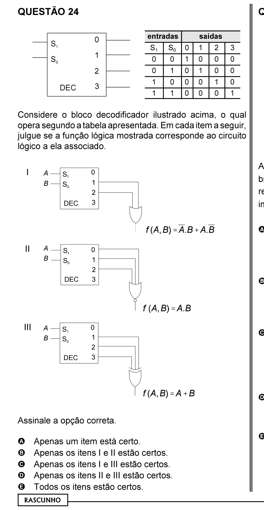

# Questão 24

A	0 B	S0

A	II B	1

A	0 B	S0

## Alternativas

A. Apenas um item está certo.
B. Apenas os itens I e II estão certos.
C. Apenas os itens I e III estão certos.
D. Apenas os itens II e III estão certos.
E. Todos os itens estão certos.
