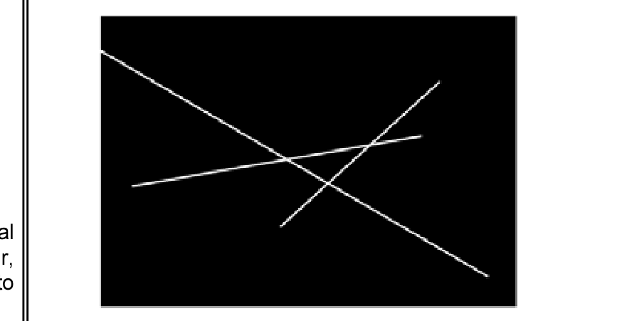

# Questão 25

A figura acima ilustra uma imagem binária com pixels brancos formando retas sobre um fundo preto. Com relação à aplicação de transformadas sobre essa imagem, assinale a opção correta.

## Alternativas

A. A transformada de Fourier, quando aplicada à imagem descrita, produz como resultado um mapa de freqüências que equivale ao histograma dos níveis de cinza das retas presentes.
B. transformada A	de Hadamard da imagem apresentada tem resultado equivalente à aplicação de um filtro passa-baixas, o que destaca as retas existentes.
C. Ao se aplicar a transformada da distância à imagem binária, considerando pixels brancos como objetos, são geradas as distâncias entre as retas presentes e o centro da imagem, o que permite identificar as equações das retas formadas na imagem.
D. O uso da transformada dos cossenos produz uma lista dos coeficientes lineares e angulares das diversas retas existentes nessa imagem binária.
E. O resultado da aplicação da transformada de Hough usando parametrização de retas é um mapa cujos picos indicam os pixels colineares, permitindo que sejam identificados coeficientes que descrevem as diversas retas formadas na imagem.
