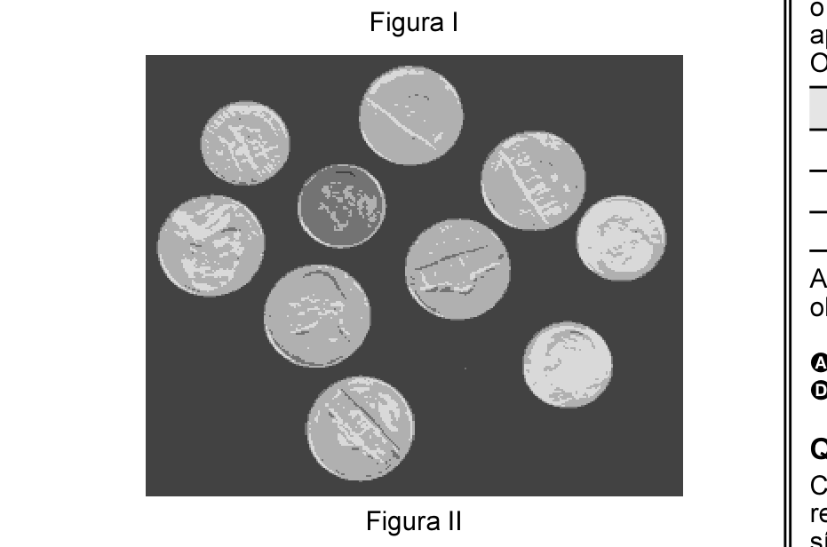
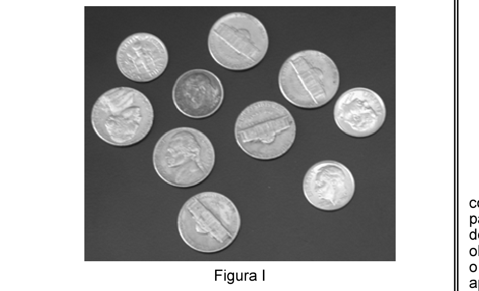

# Questão 26

As figuras I e II apresentam duas imagens, ambas com resolução de 246 pixels × 300 pixels, sendo que a figura I apresenta 256 níveis de cinza e a figura II, 4 níveis de cinza. Considere que a imagem da figura I seja a original, tendo sido manipulada em um único atributo para gerar a imagem da figura II. Nessa situação, em qual atributo se diferenciam as imagens I e II acima?

## Alternativas

A. resolução
B. quantização
C. iluminação
D. escala
E. amostragem espacial
