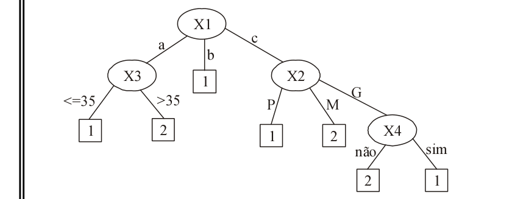
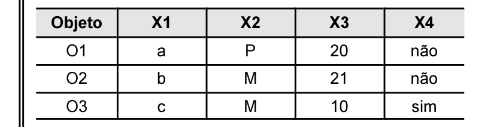

# Questão 28

A figura acima mostra uma árvore de decisão construída por um algoritmo de aprendizado indutivo a partir de um conjunto de dados em que os objetos são descritos por 4 atributos: X1, X2, X3 e X4. Dado um objeto de classe desconhecida, essa árvore classifica o objeto na classe 1 ou na classe 2. A tabela a seguir apresenta três objetos a serem classificados: O1, O2 e O3.

A que classes corresponderiam, respectivamente, os objetos O1, O2 e O3?

## Alternativas

A. 1, 1 e 2
B. 1, 2 e 1
C. 2, 1 e 2
D. 2, 2 e 1
E. 1, 1 e 1
