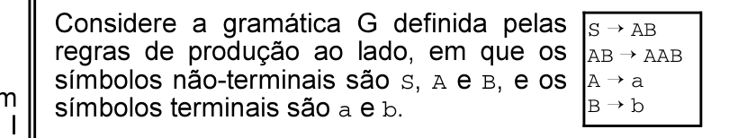

# Questão 29

Considere a gramática G definida pelas regras de produção ao lado, em que os símbolos não-terminais são S, A e B, e os A ÷ a B ÷ b símbolos terminais são a e b. Com relação a essa gramática, é correto afirmar que

## Alternativas

A. a gramática G é ambígua.
B. a gramática G é uma gramática livre de contexto.
C. a cadeia aabbb é gerada por essa gramática.
D. é possível encontrar uma gramática regular equivalente a G.
E. a gramática G gera a cadeia nula.
