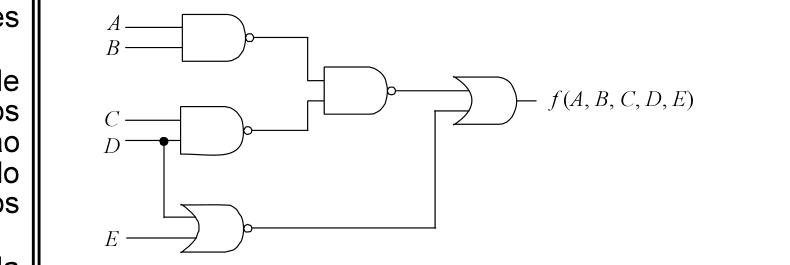
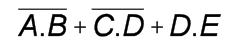
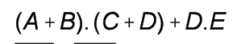
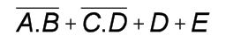
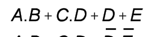
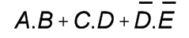

# Questão 38

No circuito acima, que possui cinco entradas — A, B, C, D e E — e uma saída f (A, B, C, D, E), qual opção apresenta uma expressão lógica equivalente à função f (A, B, C, D, E)?

## Alternativas

A. 
B. 
C. 
D. 
E. 
