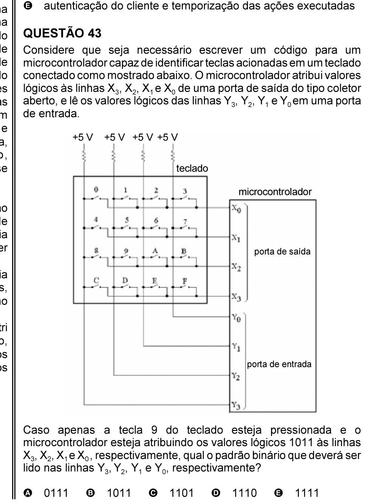

# Questão 41

Em ambientes de manufatura integrada, utilizam- se computadores para conectar processos concorrentes separados fisicamente, isto é, um sistema integrado requer dois ou mais computadores conectados para trocar informações. Quando integrados, os processos podem compartilhar informações e iniciar ações, permitindo decisões mais rápidas com menos erros. A automação também permite a execução de processos de manufatura sem necessidade de intervenções. Um exemplo simples pode ser um controlador de um robô e um controlador

planta inteira de manufatura

sistemática pelo uso de ferramentas manipulação matemática, decomposição, concorrência etc. contexto, julgue os seguintes itens. I computadores para processamento

utilizados como sub-rotinas. II

mínimo, 9 bits.

tokens permitindo que ou recursos em uma mesma sub-rede. Assinale a opção correta.

## Alternativas

A. Apenas um item está certo.
B. Apenas os itens I e II estão certos.
C. Apenas os itens I e III estão certos.
D. Apenas os itens II e III estão certos.
E. Todos os itens estão certos.
