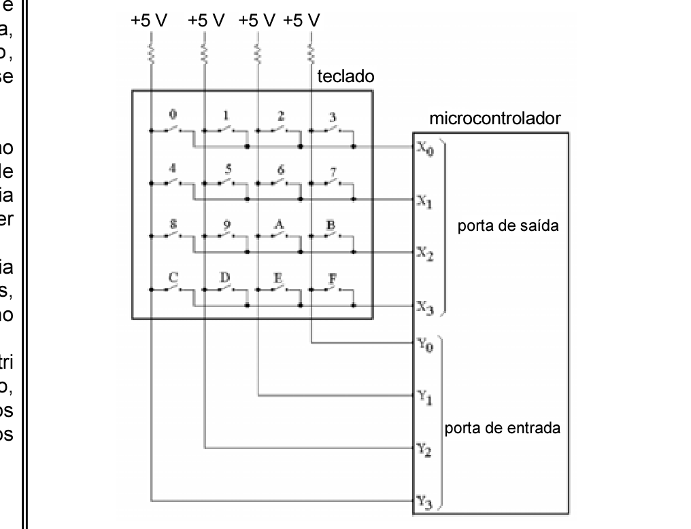

# Questão 43

Considere que seja necessário escrever um código para um microcontrolador capaz de identificar teclas acionadas em um teclado conectado como mostrado abaixo. O microcontrolador atribui valores lógicos às linhas X3, X2, X1 e X0 de uma porta de saída do tipo coletor aberto, e lê os valores lógicos das linhas Y3, Y2, Y1 e Y0 em uma porta de entrada.

Caso apenas a tecla 9 do teclado esteja pressionada e o microcontrolador esteja atribuindo os valores lógicos 1011 às linhas X3, X2, X1e X0, respectivamente, qual o padrão binário que deverá ser lido nas linhas Y3, Y2, Y1 e Y0, respectivamente?

## Alternativas

A. 0111
B. 1011
C. 1101
D. 1110
E. 1111
