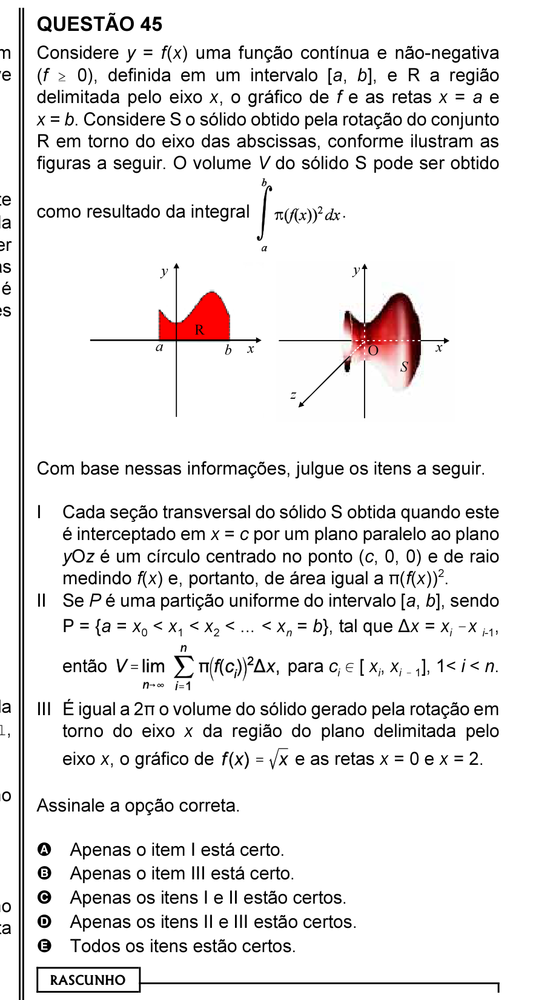

# Questão 45

## Alternativas

A. Apenas o item I está certo.
B. Apenas o item III está certo.
C. Apenas os itens I e II estão certos.
D. Apenas os itens II e III estão certos.
E. Todos os itens estão certos.
