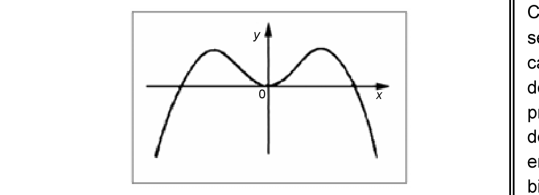

# Questão 46

No plano de coordenadas cartesianas xOy acima, está representado o gráfico de uma função contínua e derivável y = f(x). A partir dessas informações, qual opção apresenta características corretas acerca da função y?

## Alternativas

A. A função y possui derivada de primeira ordem positiva em todo o seu domínio.
B. A função y possui derivada de segunda ordem positiva em todo o seu domínio.
C. A função y possui exatamente dois pontos críticos de primeira ordem em todo o seu domínio.
D. A função y possui exatamente dois pontos de inflexão em todo o seu domínio.
E. A função y tem exatamente dois zeros em todo o seu domínio.
