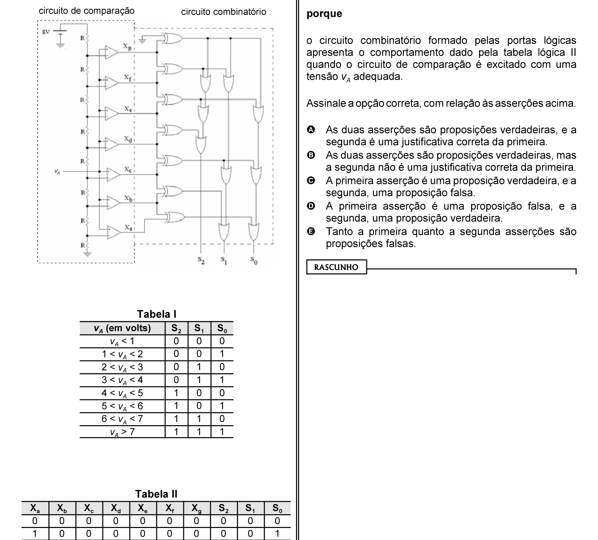

# Questão 50

Considere, a seguir, o circuito combinatório, a tensão analógica VA definida pela tabela I, e a tabela lógica definida pela tabela II.

Analise o circuito, os dados das tabelas I e II e as seguintes asserções. O circuito apresentado converte a tensão analógica vA em uma palavra de três bits cujo valor binário é uma representação quantizada da tensão vA, conforme apresentado na tabela I

## Alternativas

A. As duas asserções são proposições verdadeiras, e a segunda é uma justificativa correta da primeira.
B. As duas asserções são proposições verdadeiras, mas a segunda não é uma justificativa correta da primeira.
C. A primeira asserção é uma proposição verdadeira, e a segunda, uma proposição falsa.
D. A primeira asserção é uma proposição falsa, e a segunda, uma proposição verdadeira.
E. Tanto a primeira quanto a segunda asserções são proposições falsas.
