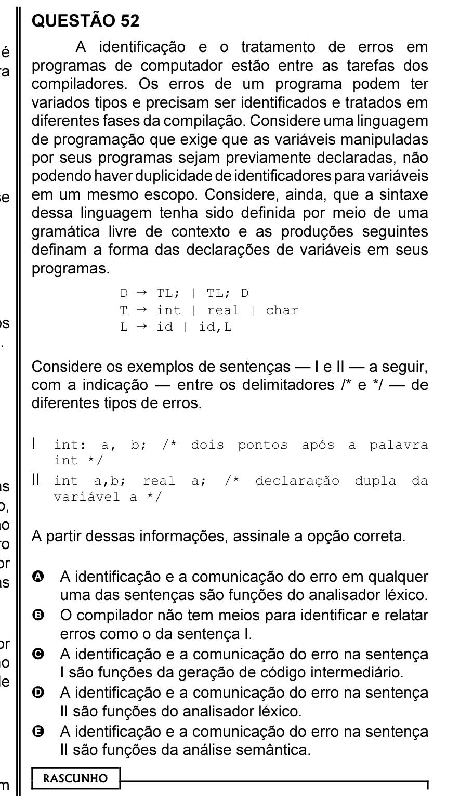
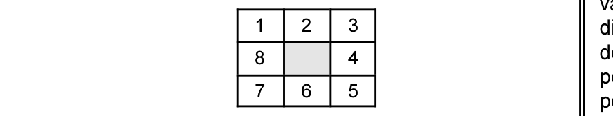
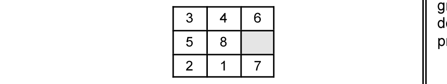

# Questão 51

o seguinte estado final.

tenha o estado E0 a seguir.

possíveis são os estados E1, E2 e E3 mostrados abaixo.

informações analise as asserções a seguir.

ser E3 porque,

menor soma das distâncias entre a posição atual das peças e a posição final é o estado E3. Assinale a opção correta a respeito dessas asserções.

## Alternativas

A. As duas asserções são proposições verdadeiras, e a segunda é uma justificativa correta da primeira.
B. As duas asserções são proposições verdadeiras, e a segunda não é uma justificativa correta da primeira.
C. A primeira asserção é uma proposição verdadeira, e a segunda é uma proposição falsa.
D. A primeira asserção é uma proposição falsa, e a segunda é uma proposição verdadeira.
E. As duas asserções são proposições falsas.
