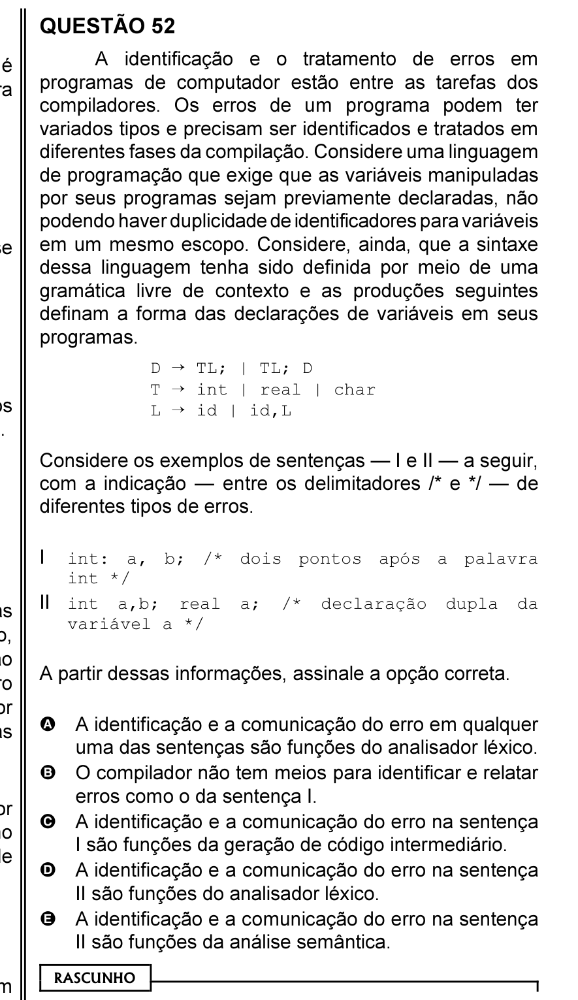

# Questão 52

A identificação e o tratamento de erros em

D ÷ TL; | TL; D

A partir dessas informações, assinale a opção correta.

## Alternativas

A. A identificação e a comunicação do erro em qualquer uma das sentenças são funções do analisador léxico.
B. O compilador não tem meios para identificar e relatar erros como o da sentença I.
C. A identificação e a comunicação do erro na sentença I são funções da geração de código intermediário.
D. A identificação e a comunicação do erro na sentença II são funções do analisador léxico.
E. A identificação e a comunicação do erro na sentença II são funções da análise semântica.
