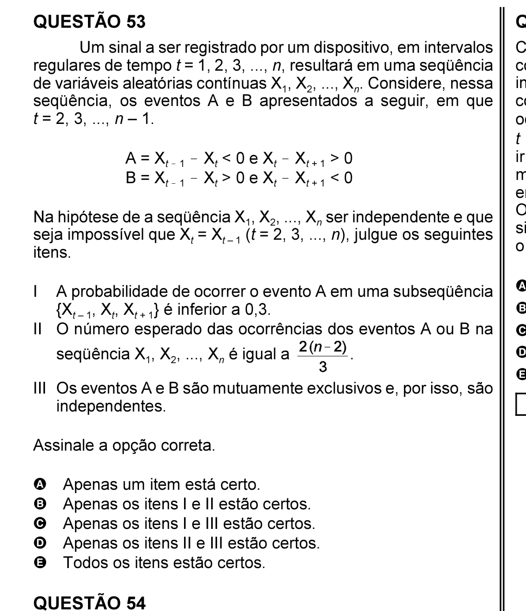

# Questão 53

A = Xt ! 1 ! Xt < 0 e Xt ! Xt + 1 > 0 B = Xt ! 1 ! Xt > 0 e Xt ! Xt + 1 < 0

itens. I A probabilidade de ocorrer o evento A em uma subseqüência II

## Alternativas

A. Apenas um item está certo.
B. Apenas os itens I e II estão certos.
C. Apenas os itens I e III estão certos.
D. Apenas os itens II e III estão certos.
E. Todos os itens estão certos.
