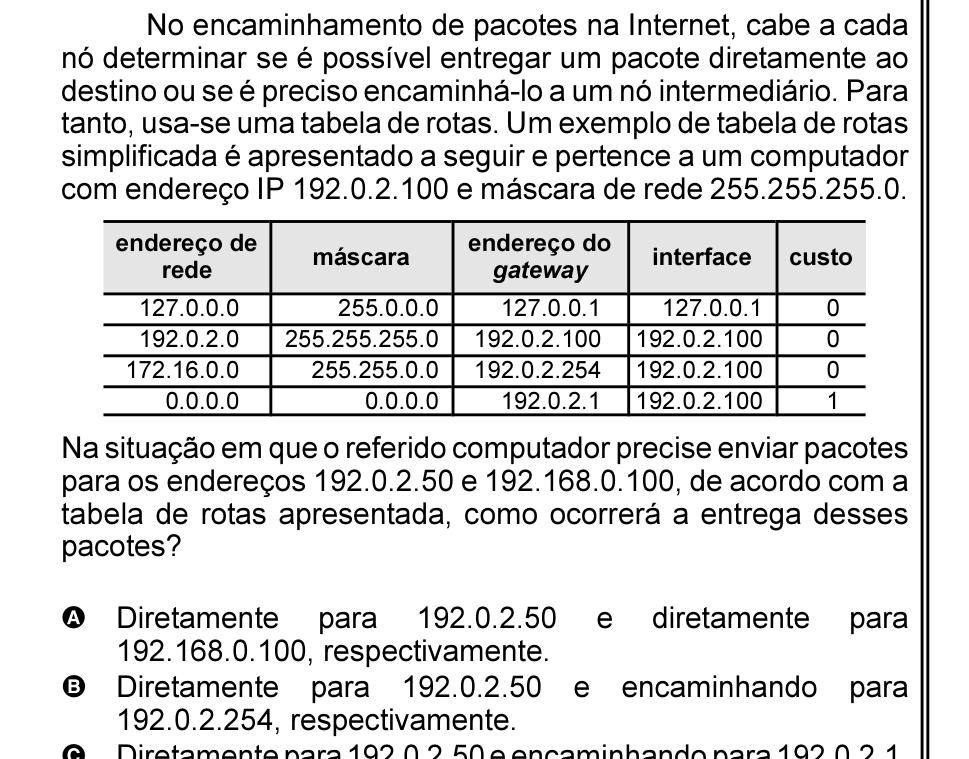

# Questão 54

nó determinar se é possível entregar um pacote diretamente ao destino ou se é preciso encaminhá-lo a um nó intermediário. Para tanto, usa-se uma tabela de rotas. Um exemplo de tabela de rotas simplificada é apresentado a seguir e pertence a um computador com endereço IP 192.0.2.100 e máscara de rede 255.255.255.0.

Na situação em que o referido computador precise enviar pacotes para os endereços 192.0.2.50 e 192.168.0.100, de acordo com a tabela de rotas apresentada, como ocorrerá a entrega desses pacotes?

## Alternativas

A. Diretamente para 192.0.2.50 e diretamente para 192.168.0.100, respectivamente.
B. Diretamente para 192.0.2.50 e encaminhando para 192.0.2.254, respectivamente.
C. Diretamente para 192.0.2.50 e encaminhando para 192.0.2.1, respectivamente.
D. Encaminhando para 192.0.2.50 e encaminhando para 192.0.2.50, respectivamente.
E. Encaminhado para 192.0.2.254 e diretamente para 192.168.0.100, respectivamente.
