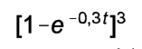
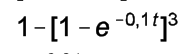
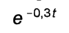
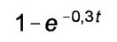
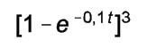

# Questão 55

Considere que um sistema seja constituído por três componentes montados em paralelo que funcionam independentemente. Para cada um desses componentes, a probabilidade de que uma falha ocorra até o tempo t é dada por , em que t > 0. Os componentes, após falharem, são irrecuperáveis. Como os componentes estão montados em paralelo, o sistema falha no instante em que todos os três componentes tiverem falhado. O sistema é também irrecuperável. Considerando a situação apresentada, qual é a probabilidade de que o sistema falhe até o tempo t ?

## Alternativas

A. 
B. 
C. 
D. 
E. 
