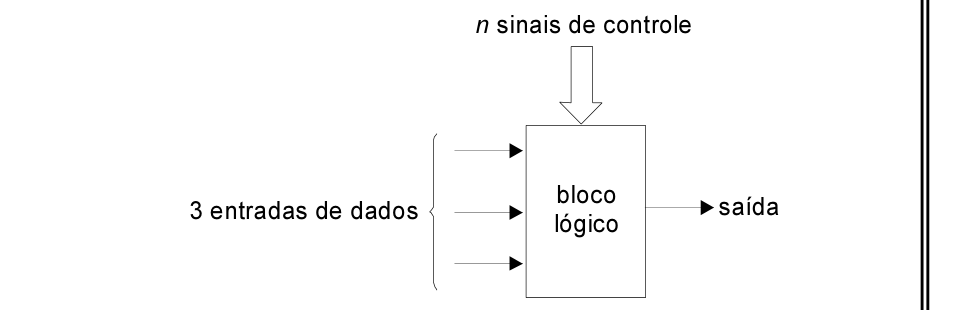

# Questão 57

Deseja-se projetar um bloco lógico do tipo look-up table que fará parte de um dispositivo lógico programável. O bloco lógico, ilustrado abaixo, deve produzir em sua saída qualquer uma das diferentes funções lógicas possíveis envolvendo três entradas de dados, dependendo dos valores lógicos aplicados a n sinais binários de controle.

Para esse bloco lógico, qual é o menor valor de n que pode ser usado para selecionar uma das diferentes funções lógicas possíveis?

## Alternativas

A. 4
B. 8
C. 16
D. 256
E. 65.536
