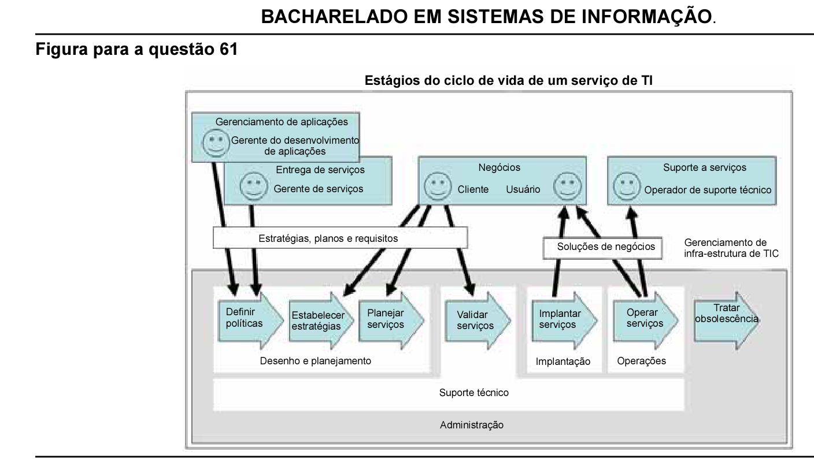

# Questão 61

A figura acima, adaptada do documento que descreve o gerenciamento de serviços de tecnologia da informação do modelo ITIL (Information Technology Infra-Structure Library), apresenta as relações entre elementos que participam dos estágios do ciclo de vida de um serviço de TI. Com base no modelo acima descrito, qual elemento detém maior responsabilidade por definir as necessidades de informação da organização que utilizará um serviço de TI?

## Alternativas

A. usuário
B. cliente
C. operador de suporte técnico
D. gerente de serviços
E. gerente de desenvolvimento de aplicações
