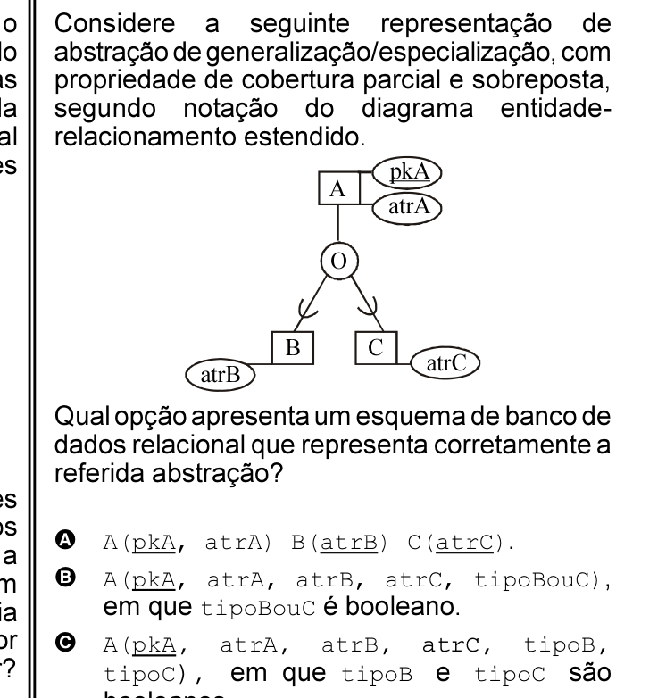

# Questão 62

O código de ética da Organização Internacional de Instituições Supremas de Auditoria (INTOSAI) define como valores e princípios básicos da atuação da auditoria a independência, a objetividade, a imparcialidade, o segredo profissional e a competência. Ao iniciar um trabalho de auditoria sem definir claramente a finalidade da auditoria e o modelo de conformidade no qual a auditoria se apóia, qual valor ou princípio um auditor estaria primariamente falhando em atender? Suporte a serviços Operador de suporte técnico

Gerenciamento de infra-estrutura de TIC

Tratar Operar obsolescência serviços Operações

## Alternativas

A. independência
B. objetividade
C. imparcialidade
D. segredo profissional
E. competência Suporte a serviços Operador de suporte técnico Gerenciamento de infra-estrutura de TIC Tratar Operar obsolescência serviços Operações
