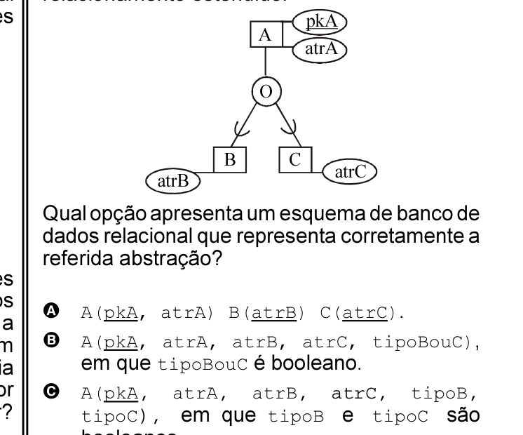

# Questão 63

Considere a seguinte representação de abstração de generalização/especialização, com propriedade de cobertura parcial e sobreposta, segundo notação do diagrama entidade- relacionamento estendido.

Qual opção apresenta um esquema de banco de dados relacional que representa corretamente a referida abstração?

## Alternativas

A. A(pkA, atrA) B(atrB) C(atrC).
B. A(pkA, atrA, atrB, atrC, tipoBouC), em que tipoBouC é booleano.
C. A(pkA, atrA, atrB, atrC, tipoB, tipoC), em que tipoB e tipoC são booleanos.
D. B(pkA, atrA, atrB) C(pkA, atrA, atrC).
E. A(pkA, atrA) B(pkB, atrB) C(pkC, atrC), em que pkB e pkC são atributos artificiais criados para ser a chave primária das relações B e C, respectivamente.
