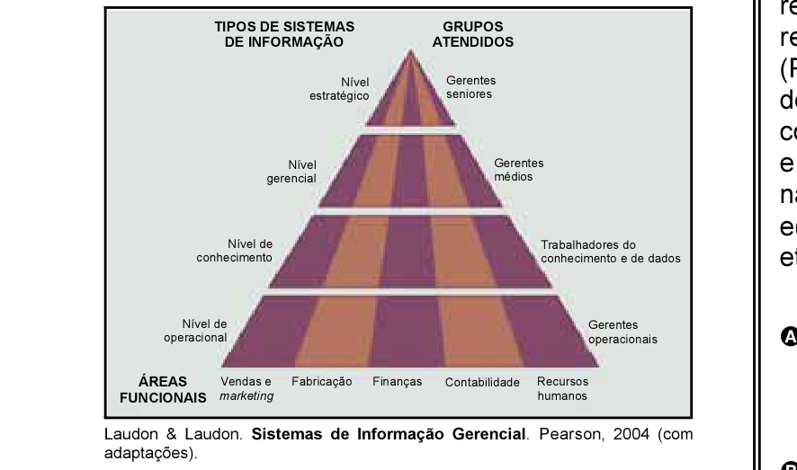

# Questão 64

A figura abaixo apresenta uma proposta de classificação de sistemas de informação, organizada tanto no que se refere ao nível hierárquico, no qual atuam os sistemas no âmbito de uma organização, quanto no que se refere às áreas funcionais nas quais esses sistemas são aplicados.

Considere a situação hipotética em que uma rede de supermercados deverá tomar uma decisão com relação à substituição do sistema de automação de “frente de loja”, que apóia as atividades dos caixas nos check-outs. A decisão envolve substituir o sistema atual, que emprega tecnologia de terminais “burros”, por um que emprega computadores pessoais e redes sem fio. Nesse sentido e considerando a proposta de classificação apresentada, qual das opções a seguir apresenta uma classificação adequada de nível hierárquico, área funcional e grupo atendido pelo sistema de informações, que oferece apoio direto à referida tomada de decisão?

## Alternativas

A. estratégico, vendas e marketing, gerentes seniores
B. conhecimento, finanças, trabalhadores do conhecimento
C. gerencial, contabilidade, gerentes médios
D. marketing, operacional, vendas e gerentes operacionais
E. estratégico, recursos humanos, gerentes médios
