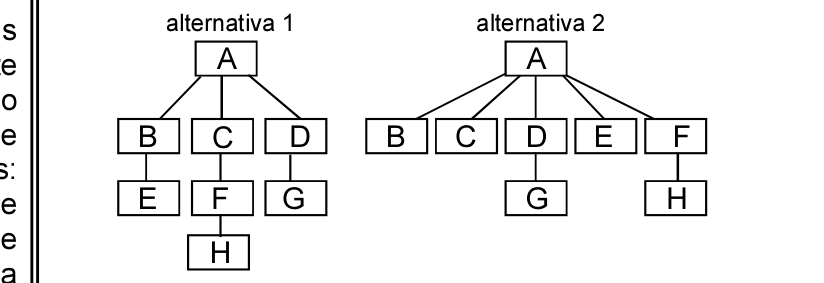

# Questão 71

Coesão e acoplamento são dois conceitos fundamentais para a qualidade do projeto modular de um software. A coesão diz respeito à funcionalidade dos módulos que compõem o software e é relacionada ao conceito de ocultação de informação. O acoplamento está relacionado aos dados e representa a interconexão entre os módulos. Suponha que determinado sistema possa ter a arquitetura de seus módulos projetada por meio das duas alternativas diferentes mostradas na figura acima, sendo a funcionalidade de um módulo a mesma nas duas alternativas. Nessa figura, os retângulos representam os módulos e as arestas representam chamadas a funcionalidades de outros módulos. A partir dessas informações, assinale a opção correta.

## Alternativas

A. A coesão e o acoplamento de todos os módulos são iguais nas duas alternativas.
B. Em relação à alternativa 1, na alternativa 2, a coesão do módulo A é menor, a dos módulos B e C é maior e o acoplamento do projeto é maior.
C. Em relação à alternativa 1, na alternativa 2, a coesão do módulo A é maior, a dos módulos B e C é menor e o acoplamento do projeto é maior.
D. Em relação à alternativa 1, na alternativa 2, a coesão do módulo A é maior, a dos módulos B e C é maior e o acoplamento do projeto é menor.
E. Em relação à alternativa 1, na alternativa 2, a coesão do módulo A é menor, a dos módulos B e C é maior e o acoplamento do projeto é menor.
