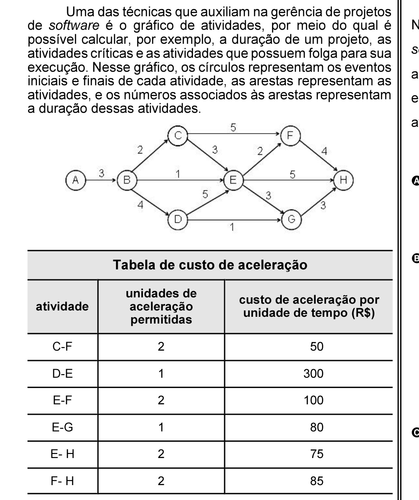

# Questão 73

Considerando-se o gráfico de atividades acima e a tabela de custo de aceleração das atividades da rede que podem ser aceleradas, qual(is) atividade(s) deve(m) ser acelerada(s) para que o tempo do projeto associado a esse gráfico seja reduzido em uma unidade de tempo e para que o custo total de aceleração seja o menor possível?

## Alternativas

A. apenas a atividade (C-F)
B. apenas as atividades (D-E) e (E-G)
C. apenas a atividade (E-G)
D. apenas as atividades (E-G) e (F-H)
E. apenas a atividade (E-H)
