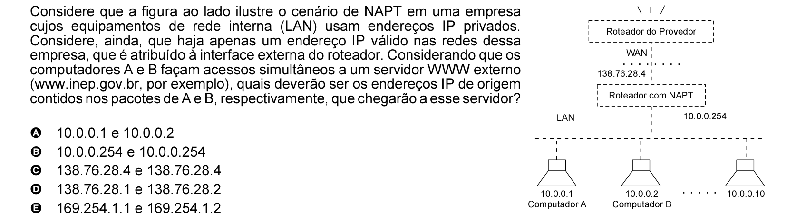

# Questão 75

Considere que a figura ao lado ilustre o cenário de NAPT em uma empresa

cujos equipamentos de rede interna (LAN) usam endereços IP privados. Considere, ainda, que haja apenas um endereço IP válido nas redes dessa empresa, que é atribuído à interface externa do roteador. Considerando que os computadores A e B façam acessos simultâneos a um servidor WWW externo (www.inep.gov.br, por exemplo), quais deverão ser os endereços IP de origem contidos nos pacotes de A e B, respectivamente, que chegarão a esse servidor?

## Alternativas

A. 10.0.0.1 e 10.0.0.2
B. 10.0.0.254 e 10.0.0.254
C. 138.76.28.4 e 138.76.28.4
D. 138.76.28.1 e 138.76.28.2
E. 169.254.1.1 e 169.254.1.2
