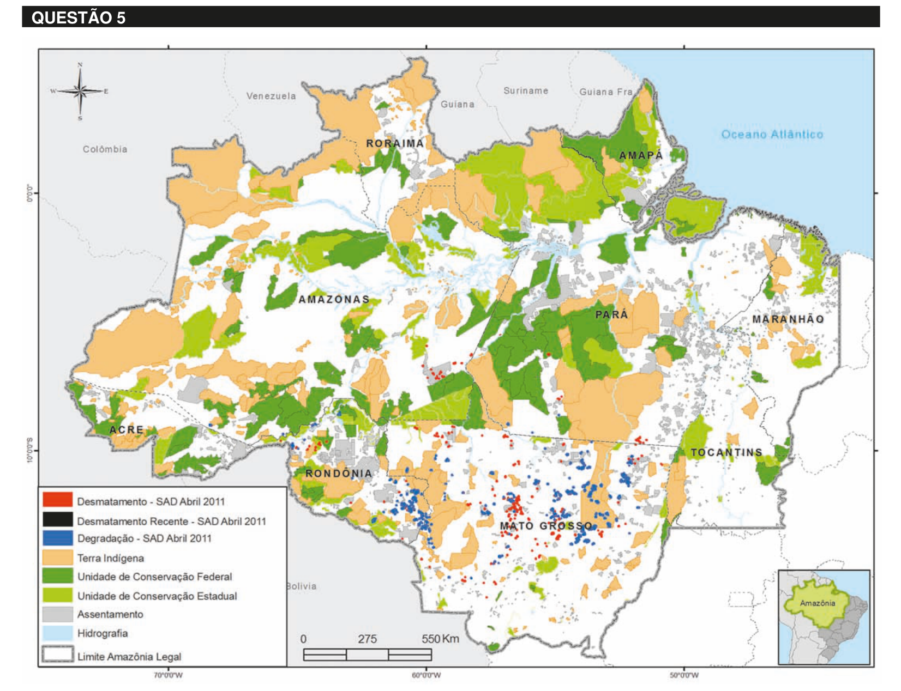

# Questão 5

Desmatamento na Amazônia Legal. Disponível em: <www.imazon.org.br/mapas/desmatamento-mensal-2011>. Acesso em: 20 ago. 2011. O ritmo de desmatamento na Amazônia Legal diminuiu no mês de junho de 2011, segundo levantamento feito pela organização ambiental brasileira Imazon (Instituto do Homem e Meio Ambiente da Amazônia). O relatório elaborado pela ONG, a partir de imagens de satélite, apontou desmatamento de 99 km² no bioma em junho de 2011, uma redução de 42% no comparativo com junho de 2010. No acumulado entre agosto de 2010 e junho de 2011, o desmatamento foi de 1 534 km², aumento de 15% em relação a agosto de 2009 e junho de 2010. O estado de Mato Grosso foi responsável por derrubar 38% desse total e é líder no ranking do desmatamento, seguido do Pará (25%) e de Rondônia (21%). Disponível em: <http://www.imazon.org.br/imprensa/imazon-na-midia>. Acesso em: 20 ago. 2011(com adaptações). De acordo com as informações do mapa e do texto,

## Alternativas

A. foram desmatados 1 534 km² na Amazônia Legal nos últimos dois anos.
B. não houve aumento do desmatamento no último ano na Amazônia Legal.
C. três estados brasileiros responderam por 84% do desmatamento na Amazônia Legal entre agosto de 2010 e junho de 2011.
D. o estado do Amapá apresenta alta taxa de desmatamento em comparação aos demais estados da Amazônia Legal.
E. o desmatamento na Amazônia Legal, em junho de 2010, foi de 140 km2, comparando-se o índice de junho de 2011 ao índice de junho de 2010.
