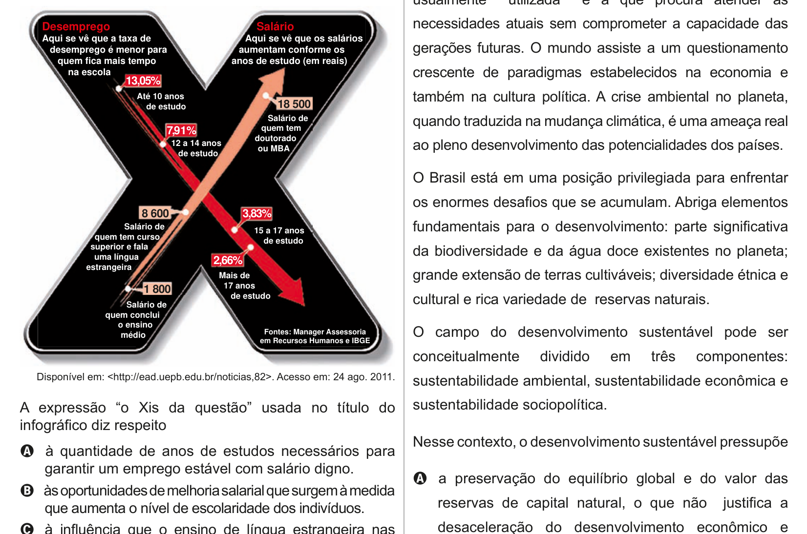

# Questão 6

A educação é o Xis da questão

A expressão “o Xis da questão” usada no título do

## Alternativas

A. à quantidade de anos de estudos necessários para garantir um emprego estável com salário digno.
B. às oportunidades de melhoria salarial que surgem à medida que aumenta o nível de escolaridade dos indivíduos.
C. à influência que o ensino de língua estrangeira nas escolas tem exercido na vida profissional dos indivíduos.
D. aos questionamentos que são feitos acerca da quantidade mínima de anos de estudo que os indivíduos precisam para ter boa educação.
E. à redução da taxa de desemprego em razão da política atual de controle da evasão escolar e de aprovação automática de ano de acordo com a idade.
