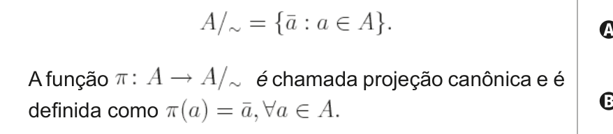

# Questão 9

Seja A um conjunto e seja ~ uma relação entre pares de elementos de A. Diz-se que ~ é uma relação de equivalência entre pares de elementos de A se as seguintes propriedades são verificadas, para quaisquer elementos a, a’ e a’’ de A: (i) a ~ a; (ii) se a ~ a’, então a’ ~ a; (iii) se a ~ a’ e a’ ~ a’’, então a ~ a’’. Uma classe de equivalência do elemento a de A com

O conjunto quociente de A pela relação de equivalência ~ é o conjunto de todas as classes de equivalência relativamente à relação ~, definido e denotado como a seguir:

A função

Considerando as definições acima, analise as afirmações a seguir. I. A relação de equivalência ~ no conjunto A particiona o conjunto A em subconjuntos disjuntos: as classes de equivalência. II. A união das classes de equivalência da relação de equivalência ~ no conjunto A resulta no conjunto das partes de A. III. As três relações seguintes

são relações de equivalência no conjunto dos

IV. Qualquer relação de equivalência no conjunto A é proveniente de sua projeção canônica. É correto apenas o que se afirma em

## Alternativas

A. II.
B. III.
C. I e III.
D. I e IV.
E. II e IV.
