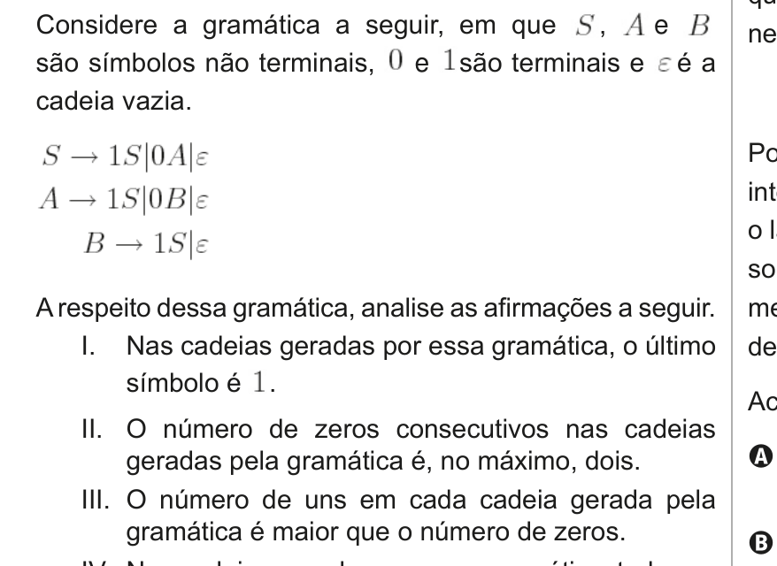

# Questão 12

A respeito dessa gramática, analise as afirmações a seguir.

IV. Nas cadeias geradas por essa gramática, todos os uns estão à esquerda de todos os zeros. É correto apenas o que se afirma em

## Alternativas

A. I.
B. II.
C. I e III.
D. II e IV.
E. III e IV.
