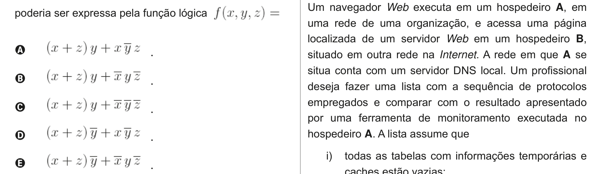

# Questão 16

Um navegador Web executa em um hospedeiro A, em

uma rede de uma organização, e acessa uma página localizada de um servidor Web em um hospedeiro B, situado em outra rede na Internet. A rede em que A se situa conta com um servidor DNS local. Um profissional deseja fazer uma lista com a sequência de protocolos empregados e comparar com o resultado apresentado por uma ferramenta de monitoramento executada no hospedeiro A. A lista assume que i) todas as tabelas com informações temporárias e caches estão vazias; ii) o hospedeiro cliente está configurado com o endereço IP do servidor DNS local. Qual das sequências a seguir representa a ordem em que mensagens, segmentos e pacotes serão observados em um meio físico ao serem enviados pelo hospedeiro A?

## Alternativas

A. ARP, DNS/UDP/IP, TCP/IP e HTTP/TCP/IP.
B. ARP, DNS/UDP/IP, HTTP/TCP/IP e TCP/IP.
C. DNS/UDP/IP, ARP, HTTP/TCP/IP e TCP/IP.
D. DNS/UDP/IP, ARP, TCP/IP e HTTP/TCP/IP.
E. HTTP/TCP/IP, TCP/IP, DNS/UDP/IP e ARP.
