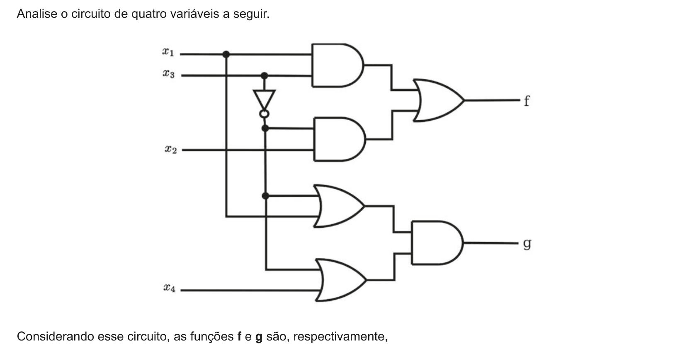
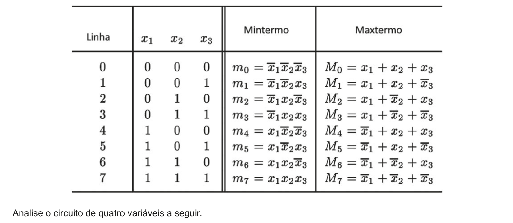

# Questão 17

A tabela a seguir apresenta a relação de mintermos e maxtermos para três variáveis.

## Alternativas

A. ∑m(0,1,2,3,6,7,8,9) e ∑m(2,3,6,7,10,14).
B. ∑m(4,5,10,11,12,13,14,15) e ∑m(0,1,4,5,8,9,11,12,13,15).
C. ∏M(0,1,2,3,6,7,8,9) e ∏M(0,1,4,5,8,9,11,12,13,15).
D. ∏M(4,5,10,11,12,13,14,15) e ∑m(2,3,6,7,10,14).
E. ∏M(4,5,10,11,12,13,14,15) e ∏M(2,3,6,7,10,14).
