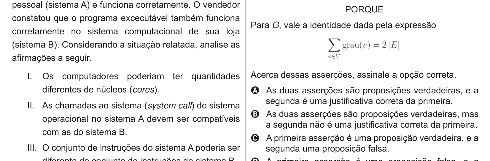

# Questão 18

Um vendedor de artigos de pesca obteve com um amigo o código executável (já compilado) de um programa que gerencia vendas e faz o controle de estoque, com o intuito de usá-lo em sua loja. Segundo o seu amigo, o referido programa foi compilado em seu sistema computacional pessoal (sistema A) e funciona corretamente. O vendedor

constatou que o programa excecutável também funciona corretamente no sistema computacional de sua loja (sistema B). Considerando a situação relatada, analise as afirmações a seguir. I. Os computadores poderiam ter quantidades diferentes de núcleos (cores). II. As chamadas ao sistema (system call) do sistema operacional no sistema A devem ser compatíveis com as do sistema B. III. O conjunto de instruções do sistema A poderia ser diferente do conjunto de instruções do sistema B. IV. Se os registradores do sistema A forem de 64 bits, os registradores do sistema B poderiam ser de 32 bits. É correto o que se afirma em

## Alternativas

A. III, apenas.
B. I e II, apenas.
C. III e IV, apenas.
D. I, II e IV, apenas.
E. I, II, III e IV.
