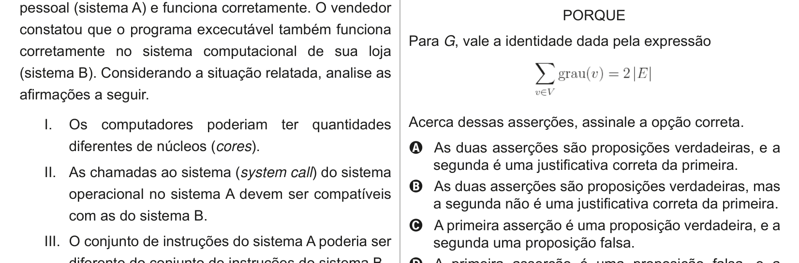

# Questão 20

Considere que G é um grafo qualquer e que V e E são os conjuntos de vértices e de arestas de G, respectivamente. Considere também que grau (v) é o grau de um vértice v pertencente ao conjunto V. Nesse contexto, analise as seguintes asserções. Em G, a quantidade de vértices com grau ímpar é ímpar.

## Alternativas

A. As duas asserções são proposições verdadeiras, e a segunda é uma justificativa correta da primeira.
B. As duas asserções são proposições verdadeiras, mas a segunda não é uma justificativa correta da primeira.
C. A primeira asserção é uma proposição verdadeira, e a segunda uma proposição falsa.
D. A primeira asserção é uma proposição falsa, e a segunda uma proposição verdadeira.
E. Tanto a primeira quanto a segunda asserções são proposições falsas.
