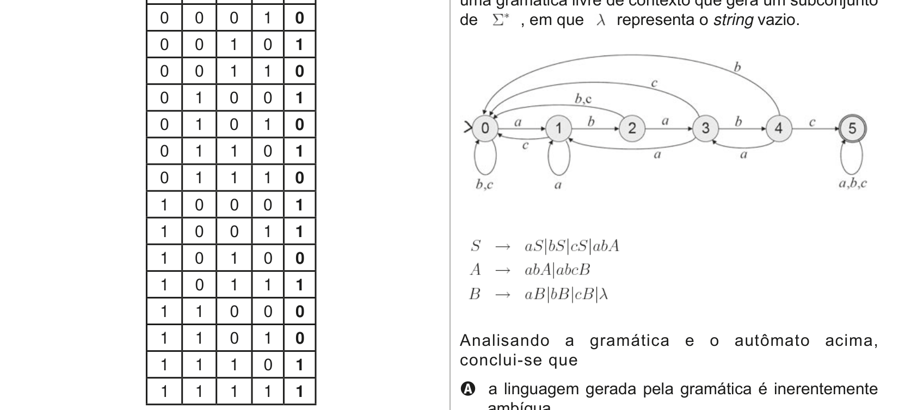
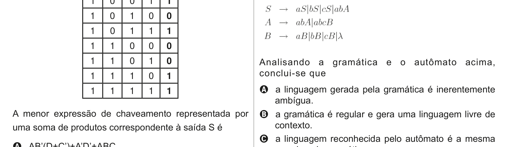

# Questão 22

Considere a seguinte tabela verdade, na qual estão definidas quatro entradas – A, B, C e D – e uma saída S. A	S C	0 B	1 D	0

| 0 | 0 | 0 | 1 | 0 |
| --- | --- | --- | --- | --- |
| 0 | 0 | 1 | 0 | 1 |
| 0 | 0 | 1 | 1 | 0 |
| 0 | 1 | 0 | 0 | 1 |
| 0 | 1 | 0 | 1 | 0 |
| 0 | 1 | 1 | 0 | 1 |
| 0 | 1 | 1 | 1 | 0 |
| 1 | 0 | 0 | 0 | 1 |
| 1 | 0 | 0 | 1 | 1 |
| 1 | 0 | 1 | 0 | 0 |
| 1 | 0 | 1 | 1 | 1 |
| 1 | 1 | 0 | 0 | 0 |
| 1 | 1 | 0 | 1 | 0 |
| 1 | 1 | 1 | 0 | 1 |
| 1 | 1 | 1 | 1 | 1 |

A menor expressão de chaveamento representada por uma soma de produtos correspondente à saída S é

## Alternativas

A. AB’(D+C’)+A’D’+ABC.
B. AD + A’BD’+A’BC+A’B’C’.
C. A’D’ + AB’D+AB’C’+ABC.
D. (A’+D)(A+B+C’)(A+B’+C+D’).
E. (A+D’)(A’+B’+C)(A’+B+C’+D).
