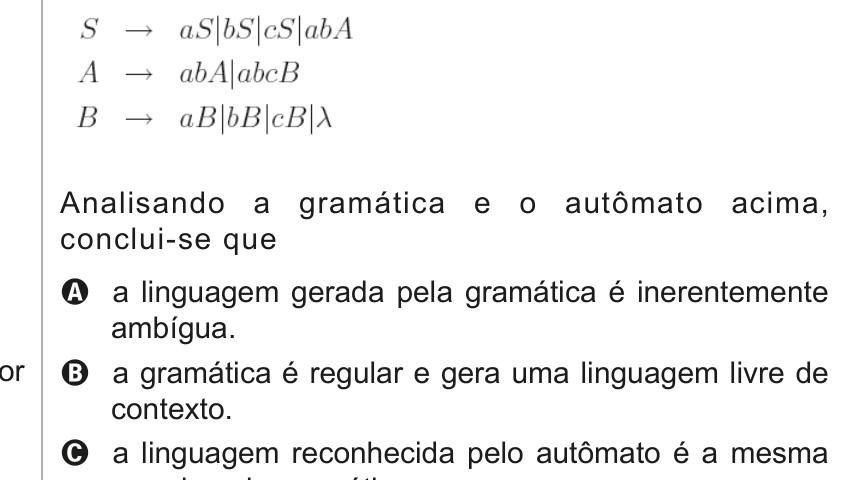

# Questão 23

Autômatos finitos possuem diversas aplicações práticas, como na detecção de sequências de caracteres em um texto. A figura abaixo apresenta um autômato que reconhece sequências sobre o alfabeto e uma gramática livre de contexto que gera um subconjunto de , em que representa o string vazio.

## Alternativas

A. a linguagem gerada pela gramática é inerentemente ambígua.
B. a gramática é regular e gera uma linguagem livre de contexto.
C. a linguagem reconhecida pelo autômato é a mesma gerada pela gramática.
D. o autômato reconhece a linguagem sobre em que os strings possuem o prefixo ababc.
E. a linguagem reconhecida pelo autômato é a mesma que a representada pela expressão regular .
