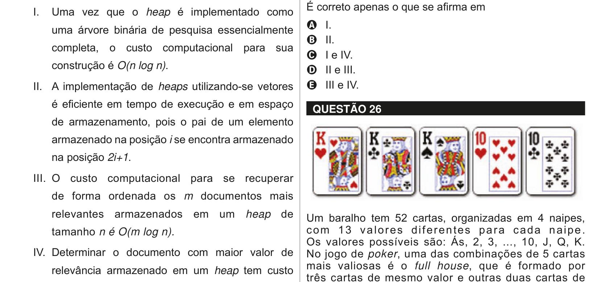

# Questão 25

Um Padrão de Projeto nomeia, abstrai e identifica os aspectos-chave de uma estrutura de projeto comum para torná-la útil para a criação de um projeto orientado a objetos reutilizáveis. GAMMA, E., HELM, R., JOHNSON, R., VLISSIDES, J. Padrões de Projeto-Soluções Reutilizáveis de Software Orientado a Objetos. Porto Alegre: Bookman, 2000. Em relação a Padrões de Projeto, analise as afirmações a seguir. I. Prototype é um tipo de padrão estrutural. II. Singleton tem por objetivos garantir que uma classe tenha ao menos uma instância e fornecer um ponto global de acesso para ela. III. Template Method tem por objetivo definir o esqueleto de um algoritmo em uma operação, postergando a definição de alguns passos para subclasses. IV. Iterator fornece uma maneira de acessar sequencialmente os elementos de um objeto agregado sem expor sua representação subjacente. É correto apenas o que se afirma em

## Alternativas

A. I.
B. II.
C. I e IV.
D. II e III.
E. III e IV.
